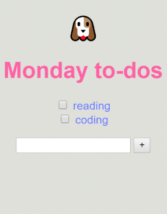

# 📝 to-do-list

**to-do-list** is a minimalist app built with MongoDB, Expess, Node.js and EJS for templating.

A living demo is in Heroku [here](https://secret-bastion-96318.herokuapp.com/).

## Installation

Clone the project and use the package manager npm to install to-do-list and its dependencies.

```bash
cd to-do-list
npm install
node app.js
```

## Usage

  
* A random animal 🦄 is rendered every time the page is refreshed.
* It is possible to add new items in the list and to delete them.
* There is a standard to-do-list with the current day as a title. The color of the title change. It is pink during the weekdays and yellow during the week-end.
* Customized lists can be created by updating the route of the app [https://secret-bastion-96318.herokuapp.com/reading-list](https://secret-bastion-96318.herokuapp.com/reading-list).

## Contributing
to-do-list has been built to learn the basics of full-stack web development.  
To do:
- [x] figure out how to work with Heroku config variables to hide the MongoDB authentification information
- [ ] add a feature to modify a to-do

## License
[MIT](https://choosealicense.com/licenses/mit/)